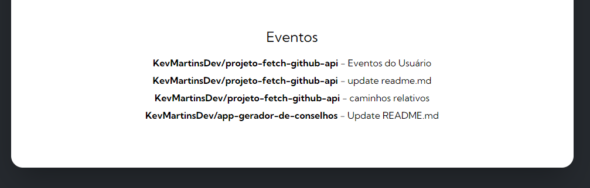

# GitHub User Search

Este projeto utiliza a API do GitHub para buscar informações de usuários e seus repositórios. O usuário pode digitar um nome de usuário do GitHub em um campo de busca, e o projeto exibirá o nome do usuário e uma lista de seus repositórios, com links para cada um.

## Funcionalidades

- Busca de usuários no GitHub.
- Exibição do nome do usuário e avatar.
- Exibição da Bio.
- Exibição do número de seguidores.
- Listagem dos repositórios do usuário com links diretos.
- Exibição da quantidade de forks.
- Exibição da quantidade de estrelas.
- Exibição da quantidade de watchers.
- Linguagem principal utilizada no repositório.
- Eventos do Usuário, PushEvents e CreateEvents. 

## Tecnologias Utilizadas

- **Frontend:** CSS, HTML e JavaScript
- **API:** GitHub API
- **Requisições HTTP:** Usando Fetch

## Captura de Tela
### Buscar Usuário

### Repositórios

### Ultimos Eventos

## GitHub Pages

Este projeto está hospedado no GitHub Pages. Você pode acessá-lo [aqui](https://kevmartinsdev.github.io/projeto-fetch-github-api/).